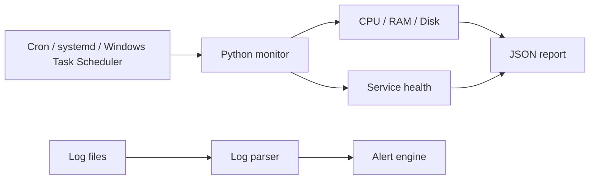

# Linux System Monitoring & Automation Toolkit

Cross-platform Python monitoring CLI plus Linux Bash utilities for routine system health checks and operational automation.

## Data flow


## Features
- CPU, memory and disk monitoring
- Linux systemd service health checks
- Windows service checks through `sc`
- ERROR/WARN/CRITICAL log parsing
- configurable threshold engine
- JSON output for automation
- optional webhook alerts
- Linux Bash health script
- cron and systemd timer examples
- Python tests on Ubuntu and Windows via GitHub Actions

## Install

```bash
python -m venv .venv
source .venv/bin/activate       # Linux/macOS
# Windows PowerShell: .venv\\Scripts\\Activate.ps1
pip install -e '.[test]'
```

Run:
```bash
python -m sysmon_tool monitor
python -m sysmon_tool logs examples/sample.log
bash scripts/linux-health.sh
```

## Sample output
```json
{"cpu_percent":21.4,"memory_percent":48.2,"disk_percent":63.1,"platform":"Linux","status":"OK","issues":[]}
```

## Automation
- Linux cron: `deploy/cron/system-monitor`
- Linux systemd: `deploy/systemd/system-monitor.service` + timer
- Windows: schedule `sysmon monitor --json` with Task Scheduler

The core Python collector uses `psutil` and platform-aware subprocess calls, avoiding Linux-only imports so the Python portion runs on Windows too.
